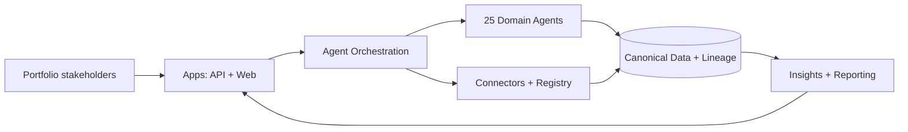

# Multi-Agent PPM Platform

AI-native Project Portfolio Management (PPM) platform blueprint with 25 specialized agents orchestrating portfolio, program, and project delivery.

[](https://github.com/your-org/multi-agent-ppm-platform/actions)
[](https://codecov.io/gh/your-org/multi-agent-ppm-platform)
[](https://opensource.org/licenses/MIT)

## Purpose

Provide an enterprise-grade solution blueprint (docs-first, code-light) for a multi-agent PPM platform. The repository defines how agents, integrations, data, and security fit together and supplies concrete artifacts (schemas, manifests, maps) that a delivery team can implement and extend.

## Architecture-level overview

The platform is structured into five layers:

1. **Experience layer**: web prototype and API gateway in `apps/`.
2. **Agent orchestration layer**: intent routing, response planning, and tool calls in `agents/`.
3. **Integration layer**: connector runtime and manifests in `connectors/`.
4. **Data layer**: canonical schemas, lineage, and quality rules in `data/`.
5. **Operations layer**: infrastructure and runbooks in `infra/` and `docs/runbooks/`.



See the full architecture narrative in [docs/architecture/system-context.md](docs/architecture/system-context.md).

## Implementation status (truthful)

| Capability | Status | Evidence |
| --- | --- | --- |
| API gateway scaffold | Partially implemented | `apps/api-gateway/` |
| Agent runtime scaffolding | Partially implemented | `agents/runtime/` |
| Agent business logic | Planned | `agents/` contains stubs/specs |
| Connector manifests + mappings | Partially implemented | `connectors/*/manifest.yaml`, `connectors/*/mappings/` |
| Canonical data schemas | Implemented | `data/schemas/` |
| Methodology maps | Implemented | `docs/methodology/*/map.yaml` |
| Observability, resilience targets | Planned | `docs/architecture/*` |

## What this platform solves

- **Portfolio chaos**: orchestrates multiple systems of record and methodologies into one AI-assisted workflow.
- **Governance gaps**: enforces stage gates and approvals across Agile, Waterfall, and Hybrid delivery.
- **Manual reporting**: automates roll-ups with data lineage and quality controls.
- **Disconnected teams**: uses specialized agents for each PPM domain with clear handoffs.

## Solution blueprint highlights

- **25-agent ecosystem** with defined roles, inputs/outputs, and example invocations.
- **Methodology maps** that encode stage gates and deliverables as YAML.
- **Connector model** with manifest, mapping, sync, and certification flow.
- **Canonical data model** with schemas for portfolio, program, project, work items, risk, issue, and vendor.
- **Security & compliance posture** aligned to RBAC/ABAC, audit logging, retention, and privacy.

## Quick links

- [Docs hub](docs/README.md)
- [Solution index (Phase 1)](docs/solution-index.md)
- [Agent catalog](docs/agents/agent-catalog.md)
- [Methodology overview](docs/methodology/overview.md)
- [Connector overview](docs/connectors/overview.md)
- [Data model & lineage](docs/data/README.md)

## Minimal demo (alpha)

The alpha build focuses on scaffolding. You can run the API gateway and web prototype locally, but most agent logic is stubbed.

```bash
make quick-start
```

**Expected services**
- API: http://localhost:8000
- API Docs: http://localhost:8000/api/docs
- Web Prototype: http://localhost:8501

## Usage examples

Query the health endpoint:

```bash
curl http://localhost:8000/healthz
```

Inspect the Agile methodology map:

```bash
rg -n "stage" docs/methodology/agile/map.yaml
```

## How to verify

Run documentation checks locally:

```bash
python scripts/check-links.py
python scripts/check-placeholders.py
```

Expected output: no link errors, and “Forbidden phrase scan passed with no matches.”

## Related docs

- [Architecture documentation](docs/architecture/README.md)
- [Connector registry](connectors/registry/connectors.json)
- [Data schemas](data/schemas/)
- [Security posture](docs/architecture/security-architecture.md)
